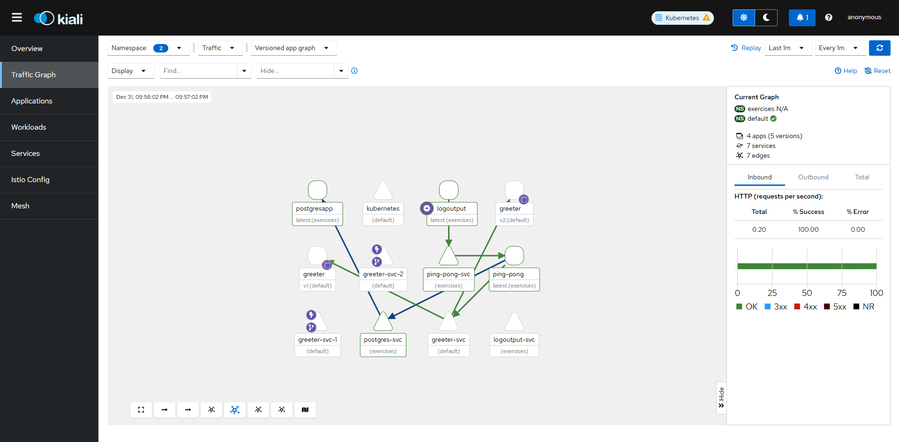

# Log output application for 1.1 Exercise of Devops with Kubernetes

This application is written in node.js, there is an image created with the
dockerfile [here](https://hub.docker.com/repository/docker/zelhs/randomstring/general).

In order to run with kubernetes we first create our cluster with **k3d**:
```bash
k3d cluster create -a 2
```
then we deploy our image from the repo:
```bash
kubectl create deployment logoutput --image=zelhs/randomstring
```
we then list our pods and get it's logs:
```bash
kubectl get pods
kubectl logs logoutput-9c7974789-7h6h9 # logoutput-9c7974789-7h6h9 was my pod name
```


## For Declerative approach

Use the .yml file by executing:

```bash
kubectl apply -f manifest/Deployment.yml
```

and repeating the next steps to get the logs.

## Update 1.7

Now an endpolint `http://localhost:8081/status` exist. We used an Ingress a **ClusterIP** service to forward 2345 port to 3000 and then use Ingress to pass traffic to 2345.

The port 80 should be mapped to 8081 in the cluster, so create a new one:

```bash
k3d cluster create --port 8082:30080@agent:0 -p 8081:80@loadbalancer --agents 2
```

## Update 1.9

Now a new endpoint listens to `/pingpong` by adding a new ClusterIP Service and a new Deployment

## update 1.10

Now a new endpoint listens to `localhost:8081/getString`. 

## update 1.11

1. Make sure `/tmp/kube` exist in **k3d-k3s-default-agent-0**

2. You need to apply the Persistent volumes and persistent volume Claims in addition to the deployment

        so run 

        ```bash
        kubectl apply -f manifest -f persistentVolumes
        ```

## update 2.3

We seperated the app's resources in our cluster using namespace `
exercises`, so you also have to create a namespace:

```bash
kubectl create namespace exercises
```

## update 2.7

Added a db to save the pings counter. For that a `statefulset` service was added. You keed to first apply this,
with it secrets and headless service by:

```bash
kubectl apply -f porsgresServices -f manifest
```

## update 3.1

If you use GKE

create a cluster:

```bash
# i'm in greece, you can choose other zone
gcloud container clusters create dwk-cluster --zone=europe-west1-b --cluster-version=latest --disk-size=32 --num-nodes=3 --machine-type=e2-medium
```

create the **exercises** namespace again

```bash
kubectl create namespace exercises
```

and then you have to apply each of the resources individualy, specifying the latest commit as:

```bash
kubectl apply -f https://raw.githubusercontent.com/andreasZel/devops_with_kubernetes_1_1_Log_Output/fd9e072b39d69535cb892c1623879d334f3ecee6/manifest/ConfigMap.yml
```

if errors with statefull set occurs delete it with the corresponding storage class if it exist.

## update 3.3

You need to create or update the cluster to use Gateway API by:

```bash
gcloud container clusters create dwk-cluster --zone=europe-west1-b --cluster-version=latest --disk-size=32 --num-nodes=3 --machine-type=e2-medium --gateway-api=standard
```

or

```bash
gcloud container clusters update dwk-cluster --location=europe-west1-b --gateway-api=standard
```

also use the commit code `85b6e486b62227908fa163e05f4b81ddce68fd14` to apply resources.

## update 4.7

We update the deployment approach to GitOps, so you need to install `argocd`

```bash
kubectl apply -n argocd -f https://raw.githubusercontent.com/argoproj/argo-cd/stable/manifests/install.yaml

kubectl patch svc argocd-server -n argocd -p '{"spec": {"type": "LoadBalancer"}}'
```

also don't forget `argo rollouts` for all deployments to work:

```bash
kubectl create namespace argo-rollouts

kubectl apply -n argo-rollouts -f https://github.com/argoproj/argo-rollouts/releases/latest/download/install.yaml
```
 
then follow instructions in class module to add the repo from argocd UI that
is exposed from the load balancer

## update 5.3

My GKE free trial expired, so i had to change things to work with k3d.

You need to install `arocd` and `argorollouts` as previously mentioned and in addition `istio` and `kiali` that is needed for this exercise:

First we install `istio`, `it's gateway` and `promitheus plug-in`:

```bash
#istio setup
helm repo add istio https://istio-release.storage.googleapis.com/charts

helm repo update

helm install istio-base istio/base -n istio-system --set defaultRevision=default --create-namespace

helm install istiod istio/istiod -n istio-system --wait

helm install istio-ingressgateway istio/gateway --namespace istio-system

kubectl apply -f https://raw.githubusercontent.com/istio/istio/release-1.28/samples/addons/prometheus.yaml

#kiali setup
kubectl apply -f https://raw.githubusercontent.com/istio/istio/release-1.28/samples/addons/kiali.yaml
```

to view kiali we just port-forward and access from web url. It won't show any network traffic unless we call the ping-pong service.

Because I made Virtual service and gateways only for greeter we need to update ping-pong and logoutput using `istio-injection`:

```bash
kubectl label namespace exercises istio-injection=enabled --overwrite
```

after that we restart or delete the pods and the network traffic will be detected by istio.

we can see the kiali diagram here:

